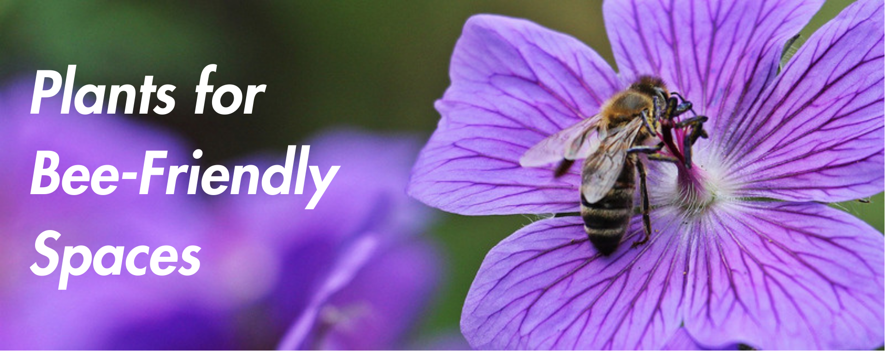
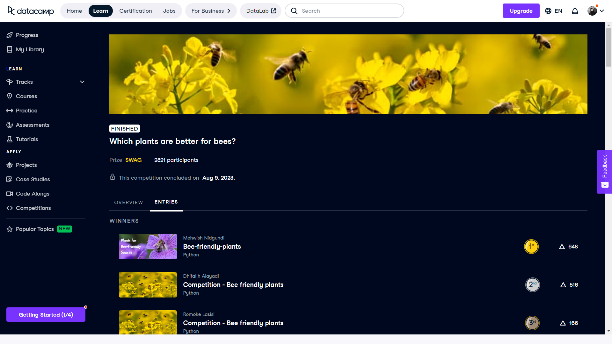

# 🐝 Bee-Friendly Plants – Classification & Analysis

This project earned **1st place** in the [DataCamp Bee Friendly Plants Competition](https://app.datacamp.com/learn/competitions/bee-friendly-plants), where participants built machine learning models to classify bee-friendly plants.  
The solution was selected for its balance of performance, clarity, and insight.

---

## 🌸 Overview

The goal of this project was to classify plants as bee-friendly or not, based on ecological and botanical features.  
It contributes to broader efforts around biodiversity, pollination, and environmental sustainability.

---

## 🎯 Project Objectives

- Explore the relationship between plant characteristics and bee-friendliness
- Clean and prepare real-world plant data
- Train predictive models for classification
- Derive insights that support environmental decision-making

---

## 🧠 My Contributions

- Conducted data cleaning, EDA, and visualization
- Engineered relevant features and handled preprocessing
- Built and compared machine learning models (Random Forest, Gradient Boosting, etc.)
- Performed hyperparameter tuning and cross-validation
- Documented model insights and interpreted results

---

## 🛠 Tools & Technologies

- **Python**: pandas, numpy, matplotlib, seaborn, scikit-learn  
- **Techniques**: One-hot encoding, normalization, feature engineering  
- **Validation**: k-fold cross-validation, metric-based evaluation  
- **Notebook**: Jupyter  
- **Dataset**: `plants_and_bees.csv` from DataCamp

---

## 🔬 Approach

### 🔧 Data Preprocessing
- Handled missing values and outliers
- Scaled and normalized numeric features
- Encoded categorical variables (e.g., flower color, bloom time)

### 🧩 Feature Engineering
- Created new features based on botanical knowledge
- Identified most predictive variables for bee-friendliness

### 🤖 Model Building
- Tested models: Random Forest, Gradient Boosting, Neural Networks
- Tuned hyperparameters using Grid Search and Random Search
- Validated using k-fold cross-validation

### 📊 Evaluation
- Evaluated with accuracy, precision, recall, and F1-score
- Selected model with optimal balance of performance and interpretability

---

## 📁 Repository Structure

- `notebook.ipynb` – full project analysis  
- `data/plants_and_bees.csv` – cleaned dataset  
- `datacamp_workspace_export_...csv` – additional files  
- Images: `image.png`, `win.png`

---

## 🙏 Acknowledgments

This project was a collaborative effort with [Mehwishh Feroz](https://github.com/MehwishhFeroz).  
The final submission was made through her account, as per competition guidelines.

---

## 📌 Status

✅ Completed and Published  
🏆 Placed 1st in DataCamp Competition  
📂 Ready for resume, GitHub, and LinkedIn portfolio
